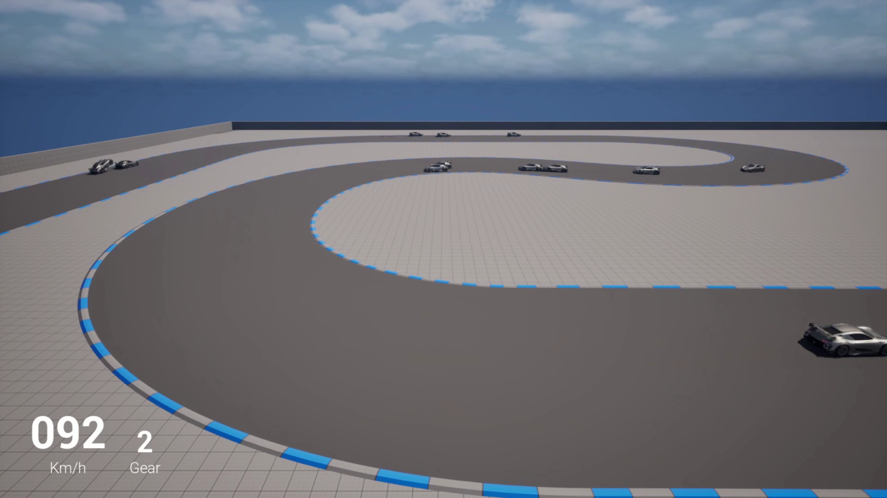
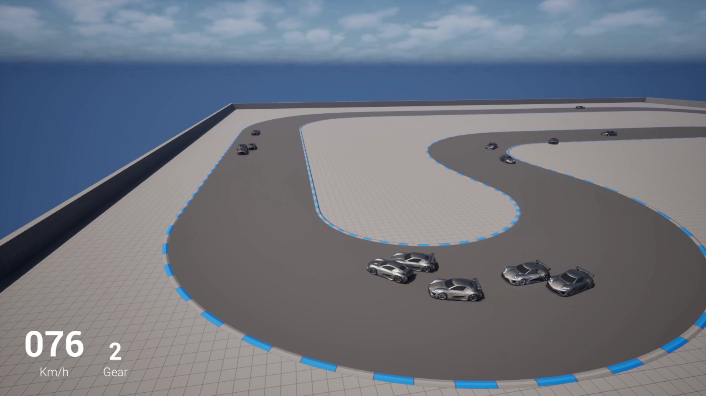

# AI Racing driver

Test and practice project for the Learning Agents plugin in Unreal Engine. Uses the Vehicle Template from Unreal Engine 5.5  

## Demo video

https://youtu.be/kJWEplgTGMg

## Preview

## Features

- PPO reinforcement learning using the Learning Agents plugin  
- Multi-agent racing environment  
- Raycast based radars on the cars  
- Multiple camera angles of the track  
- Race support system  

## Technical highlights

### Environment observations  

- Track observations - position and direction - at the current position and 50 meters in advance at every 5 meters  
- Velocity observation  
- 9 raycasted sensor observation - inspired by parking radar  
- Race related observations - track position, average speed of the car in front, signed distance from the middle of the track

### Rewards are based on:

- Velocity along the direction of the track  
- Staying on the track  
- Avoiding collisions with other cars  
- Using different racing lines when close to the car in front

### Race support system

- Respawn on the side of the track if flipped  
- Raspawn if stuck  
- Respawn if too far from the track  
- After respawn, the collision of the respawned car is turned off for 3 seconds, and only turned back on if the agent does not overlap any other cars  

## Controls

- Cycle camera views - TAB  
- Reset all cars and the camera - R

